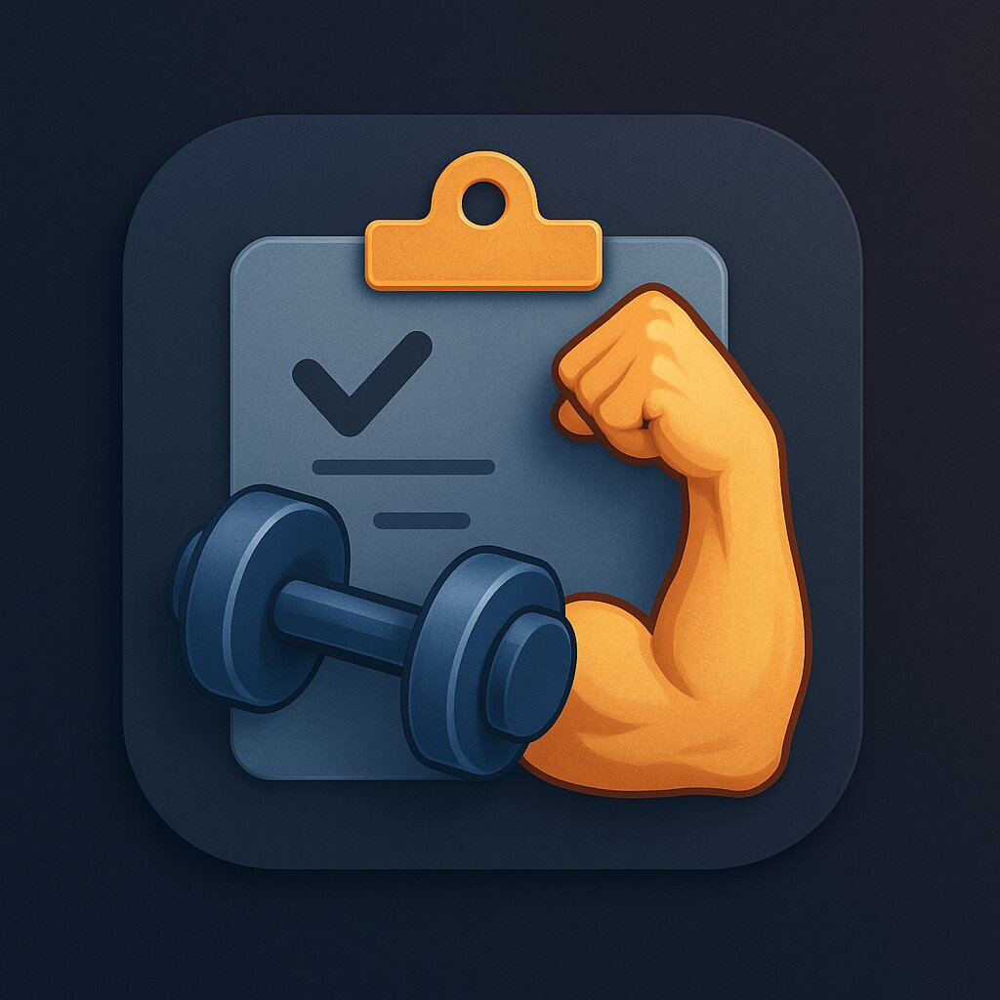

# GYM Planner - Workout & Fitness Tracker

A comprehensive fitness companion app that helps you plan workouts, track progress, monitor nutrition, and achieve your fitness goals.



## Features

### 📋 Workout Planning
- Create and customize workout plans tailored to your goals
- Organize exercises by muscle groups
- Visual exercise guides with GIF animations
- Rest day scheduling
- Estimated workout duration calculation

### 🏋️ Workout Execution
- Step-by-step exercise guidance
- Timer for rest periods
- Track sets, reps, and weights
- Body part visualization showing targeted muscles

### 📊 Progress Tracking
- Track weight and body measurements
- Visualize progress with detailed charts
- Compare workout performance over time
- Set and monitor fitness goals

### 🍎 Nutrition Tracking
- Log daily food intake
- Track calories, macros, and nutrients
- TDEE (Total Daily Energy Expenditure) calculator
- Weight management planning

### ⚙️ Personalization
- Customizable themes
- User profile with health metrics
- Notification preferences
- Workout reminders

## Screenshots

### Home Screen & Navigation
<div align="center">
  
  
</div>
<div align="center">
  <i>Main dashboard</i> &nbsp;&nbsp;&nbsp;&nbsp;&nbsp;&nbsp;&nbsp;&nbsp;&nbsp;&nbsp;&nbsp;&nbsp;&nbsp;&nbsp;&nbsp;&nbsp;&nbsp;&nbsp;&nbsp;&nbsp;&nbsp;&nbsp;&nbsp;&nbsp; <i>App navigation menu</i>
</div>

### Workout Planning
<div align="center">
  
  
</div>
<div align="center">
  <i>Workout plan overview</i> &nbsp;&nbsp;&nbsp;&nbsp;&nbsp;&nbsp;&nbsp;&nbsp;&nbsp;&nbsp;&nbsp;&nbsp;&nbsp;&nbsp; <i>Creating and editing workouts</i>
</div>

### Exercise Library
<div align="center">
  
  
</div>
<div align="center">
  <i>Browse available exercises</i> &nbsp;&nbsp;&nbsp;&nbsp;&nbsp;&nbsp;&nbsp;&nbsp;&nbsp;&nbsp; <i>Exercise detail with animation</i>
</div>

### Workout Execution
<div align="center">
  
  
</div>
<div align="center">
  <i>Starting a workout</i> &nbsp;&nbsp;&nbsp;&nbsp;&nbsp;&nbsp;&nbsp;&nbsp;&nbsp;&nbsp;&nbsp;&nbsp;&nbsp;&nbsp;&nbsp;&nbsp; <i>Performing exercises with guidance</i>
</div>

### Progress Tracking
<div align="center">
  
  
</div>
<div align="center">
  <i>Weight progress visualization</i> &nbsp;&nbsp; <i>Workout history and achievements</i>
</div>

### Nutrition Tracking
<div align="center">
  
  
</div>
<div align="center">
  <i>Nutrition overview</i> &nbsp;&nbsp;&nbsp;&nbsp;&nbsp;&nbsp;&nbsp;&nbsp;&nbsp;&nbsp;&nbsp;&nbsp;&nbsp;&nbsp;&nbsp; <i>Adding food entries</i>
</div>

### Settings & Personalization
<div align="center">
  
  
</div>
<div align="center">
  <i>App settings</i> &nbsp;&nbsp;&nbsp;&nbsp;&nbsp;&nbsp;&nbsp;&nbsp;&nbsp;&nbsp;&nbsp;&nbsp;&nbsp;&nbsp;&nbsp;&nbsp;&nbsp;&nbsp;&nbsp;&nbsp;&nbsp;&nbsp; <i>Theme customization</i>
</div>

## Installation

### Requirements
- Android 6.0 (Marshmallow) or higher
- ~50MB free storage space

### Install from Google Play
<a href='https://play.google.com/store/apps/details?id=com.H_Oussama.gymplanner'></a>

### Manual Installation
1. Download the latest APK from the [Releases](https://github.com/username/GYM_planner/releases) page
2. Enable installation from unknown sources in your device settings
3. Open the APK file and follow the installation instructions

## Development Setup

### Prerequisites
- Android Studio Arctic Fox (2020.3.1) or newer
- JDK 11 or newer
- Android SDK 31 (Android 12) or newer

### Clone and Build
```bash
# Clone the repository
git clone https://github.com/username/GYM_planner.git

# Navigate to the project directory
cd GYM_planner

# Build the debug version
./gradlew assembleDebug
```

### Run the App
- Connect an Android device or start an emulator
- Run the app using Android Studio or with the command:
```bash
./gradlew installDebug
```

## Technologies Used

- **UI Framework**: Jetpack Compose
- **Architecture**: MVVM with Clean Architecture principles
- **Dependency Injection**: Hilt
- **Database**: Room
- **Asynchronous Programming**: Kotlin Coroutines & Flow
- **Image Loading**: Coil
- **Charts**: MPAndroidChart
- **JSON Parsing**: Kotlinx Serialization
- **Persistence**: SharedPreferences, Room Database

## Contributing

Contributions are welcome! If you'd like to contribute, please:

1. Fork the repository
2. Create a feature branch (`git checkout -b feature/amazing-feature`)
3. Commit your changes (`git commit -m 'Add some amazing feature'`)
4. Push to the branch (`git push origin feature/amazing-feature`)
5. Open a Pull Request

Please ensure your code follows the project's coding style and includes appropriate tests.

## License

This project is licensed under the MIT License - see the [LICENSE](LICENSE) file for details.

## Acknowledgements

- Exercise GIFs provided by [ExerciseDB](https://exercisedb.p.rapidapi.com/)
- Icons from [Material Design Icons](https://materialdesignicons.com/)
- Special thanks to all contributors and testers

---

## Contact

Developer: H_Oussama
Email: youremail@example.com
GitHub: [Your GitHub Profile](https://github.com/username) 